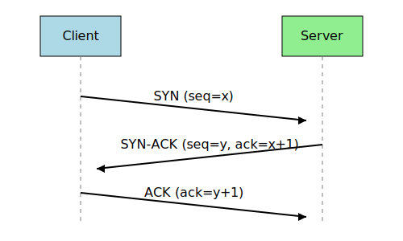

# core


<!-- WARNING: THIS FILE WAS AUTOGENERATED! DO NOT EDIT! -->

## Introduction to TCP

The Transmission Control Protocol (TCP) is one of the main protocols of
the Internet protocol suite. It provides reliable, ordered, and
error-checked delivery of a stream of bytes between applications running
on hosts communicating via an IP network.

TCP is: - **Connection-oriented**: A connection is established before
data is sent - **Reliable**: It guarantees delivery of data to the
destination - **Ordered**: If packets arrive in the wrong order, TCP
reorders them - **Error-checked**: Corrupted packets are retransmitted

## The Three-Way Handshake

TCP establishes a connection through a process called the three-way
handshake:

1.  **SYN**: Client sends a SYN (synchronize) packet with a random
    sequence number `x`
2.  **SYN-ACK**: Server responds with a SYN-ACK packet with its own
    sequence number `y` and acknowledgment number `x+1`
3.  **ACK**: Client sends an ACK packet with acknowledgment number `y+1`
    to establish the connection

``` python
from IPython.display import SVG
from IPython.display import display
```

``` python
svg_data = '''
<svg width="500" height="300" xmlns="http://www.w3.org/2000/svg">
    <rect width="100%" height="100%" fill="white"/>
    
    <!-- Entities -->
    <rect x="50" y="20" width="100" height="50" fill="lightblue" stroke="black"/>
    <text x="100" y="50" text-anchor="middle">Client</text>
    <rect x="350" y="20" width="100" height="50" fill="lightgreen" stroke="black"/>
    <text x="400" y="50" text-anchor="middle">Server</text>
    
    <!-- Lines -->
    <line x1="100" y1="70" x2="100" y2="280" stroke="gray" stroke-dasharray="5,5"/>
    <line x1="400" y1="70" x2="400" y2="280" stroke="gray" stroke-dasharray="5,5"/>
    
    <!-- Arrows -->
    <line x1="100" y1="120" x2="380" y2="150" stroke="black" stroke-width="2"/>
    <polygon points="380,150 370,145 370,155" fill="black"/>
    <text x="240" y="125" text-anchor="middle">SYN (seq=x)</text>
    
    <line x1="400" y1="180" x2="120" y2="210" stroke="black" stroke-width="2"/>
    <polygon points="120,210 130,205 130,215" fill="black"/>
    <text x="260" y="185" text-anchor="middle">SYN-ACK (seq=y, ack=x+1)</text>
    
    <line x1="100" y1="240" x2="380" y2="270" stroke="black" stroke-width="2"/>
    <polygon points="380,270 370,265 370,275" fill="black"/>
    <text x="240" y="245" text-anchor="middle">ACK (ack=y+1)</text>
</svg>
'''

display(SVG(data=svg_data))
```



## Socket API in Python

Python’s `socket` module provides a simple API for creating TCP
connections. Here are the key elements we’ll use:

We will create a simplified wrapper around Python’s socket API to make
it easier to understand TCP concepts.

------------------------------------------------------------------------

<a
href="https://github.com/Matthew-Redrup/python-tcp/blob/main/python_tcp/core.py#L17"
target="_blank" style="float:right; font-size:smaller">source</a>

### get_free_port

>  get_free_port ()

*Get an available port number by creating and closing a temporary
socket.*

Let’s define some constants for our implementation:

## Socket State Information

TCP sockets go through various states during their lifecycle:

- **CLOSED**: No connection
- **LISTEN**: Server is waiting for incoming connections
- **SYN_SENT**: Client has sent SYN packet
- **SYN_RECEIVED**: Server has received SYN and sent SYN-ACK
- **ESTABLISHED**: Connection is established
- **FIN_WAIT**: Connection termination in progress
- **CLOSE_WAIT**: Waiting for application to close
- **CLOSING**: Both sides have initiated connection termination
- **TIME_WAIT**: Waiting to ensure remote TCP received connection
  termination
- **LAST_ACK**: Waiting for last acknowledgement

We’ll create utility functions to help us track these states in our
implementation.

------------------------------------------------------------------------

<a
href="https://github.com/Matthew-Redrup/python-tcp/blob/main/python_tcp/core.py#L30"
target="_blank" style="float:right; font-size:smaller">source</a>

### SocketState

>  SocketState ()

*Constants for socket states.*

Now let’s define a basic connection structure that will help us manage
TCP connections:

------------------------------------------------------------------------

<a
href="https://github.com/Matthew-Redrup/python-tcp/blob/main/python_tcp/core.py#L46"
target="_blank" style="float:right; font-size:smaller">source</a>

### TCPConnection

>  TCPConnection (sock:Optional[socket.socket]=None, state:str='CLOSED',
>                     remote_address:Optional[Tuple[str,int]]=None,
>                     connection_id:Optional[str]=None)

*Represents a TCP connection with state information.*

Note that I’ve renamed the field from `socket` to `sock` to avoid
confusion with the module name.

## TCP Connection Lifecycle

A TCP connection goes through the following phases: 1. Connection
establishment (three-way handshake) 2. Data transfer 3. Connection
termination (four-way handshake)

In our implementation, we’ll focus on making these phases explicit and
easy to understand.
